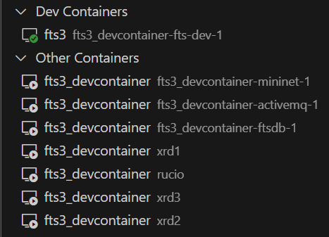

# FTS3 Quick Start

## Setting up Development Environment using Visual Studio Code

If you use Visual Studio Code as the editor, you can use "Dev Container" to
simply set up the development Environment for FTS3.

### Prerequisite

Make sure you have `docker` installed.

If possible, we highly suggest to also install the `docker-buildx` extension.

### Opening `fts3` Project in Visual Studio Code Dev Container

1. Copy `.devcontainer` and `.vscode` to the root directory of your own fts3 source code:

```
# Clone the fts3 repo to your local machine
git clone https://github.com/cern-fts/fts3

# Clone this repo to your local machine
git clone https://github.com/fno2010/fts3-quick-start

# Copy .devcontainer to the root directory of fts3
cp -r fts3-quick-start/.devcontainer fts3/

# Copy .vscode to the root directory of fts3
cp -r fts3-quick-start/.vscode fts3/
```

2. Open fts3 source code in Visual Studio Code.

3. Install "Dev Containers" extension.

4. Open the editor commands with `Ctrl`-`Shift`-`P` and run `Dev containers: reopen in dev container`.

> NOTE: At the first time, visual studio code will build the dev container image. It will take a few minutes.

5. After the dev container is ready:

    1. The following vscode extensions should be installed automatically:

        - CMake Tools
        - C/C++
        - C/C++ Extension Pack

    2. The following containers should be started:

        

## Building `fts3` from Source Code inside Dev Container

### Using CMake Tools Extension

If you have installed "Cmake Tools" extension, building `fts3` will be simple:
Open the editor commands with `Ctrl`-`Shift`-`P` and run `CMake: Build`.

### Using CLI

You can also open a terminal inside the current running Visual Studio Code Dev
Container and run the commands directly:

```
mkdir -p build
cd build
cmake3 ../ -DALLBUILD=ON
make
```

## Testing Your Own `fts3`

### Installing Local-Built `fts3`

After you verify your `fts3` source code can be compiled, you can install your
local-built `fts3` packages to the container:
Open the editor commands with `Ctrl`-`Shift`-`P` and run `Tasks: Run Task` -> `Stop and Reinstall FTS3`.

### Running Local-Built `fts3`

Once you reinstall your `fts3` successfully, you should restart the `fts-server`:
Open the editor commands with `Ctrl`-`Shift`-`P` and run `Tasks: Run Task` -> `Restart FTS3 Server`.

Then you can go to your web browser to verify if the monitoring web UI
(<https://localhost:8449/fts3/ftsmon/>) can be opened.

### Testing Local-Built `fts3` with Mininet

If you are going to test your `fts3` with mininet, you should go to an external
terminal first.

> NOTE: the terminal in your visual studio code may not work, because it has
> already been inside the container.

In you external terminal, you can first check your docker compose project name:

```sh
$ docker-compose ls -q
fts3_devcontainer
```

By default, it should be `fts3_devcontainer`.

Then you can enter your mininet container and start the example mininet topology:

``` sh
$ docker-compose -p fts3_devcontainer exec mininet bash
root@0d353983c37e:/containernet# python3 /utils/rucio_example.py
```

To submit the testing transfers, you can go to another external terminal, and
use the `.devcontainer/container-utils/fts_utils.sh`:

``` sh
$ cd .devcontainer/container-utils
$ . fts_utils.sh
```

Then you can follow the same instruction in [this
guidance](https://github.com/openalto/ietf-hackathon/blob/fts/docs/fts_usage.md#configure-ruciofts-and-generate-workloads).

